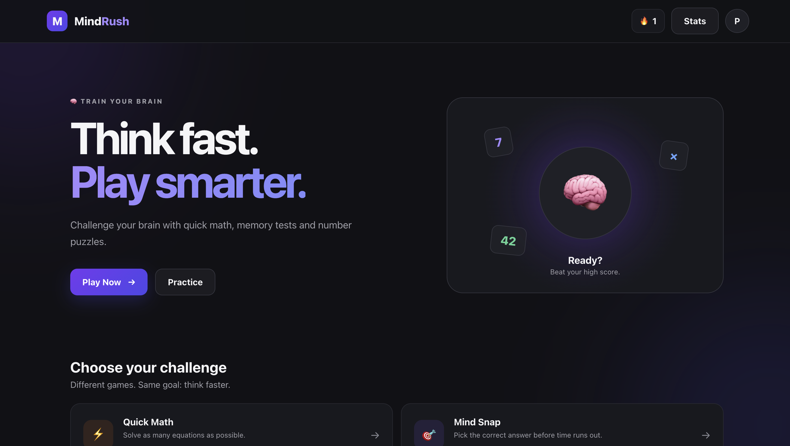
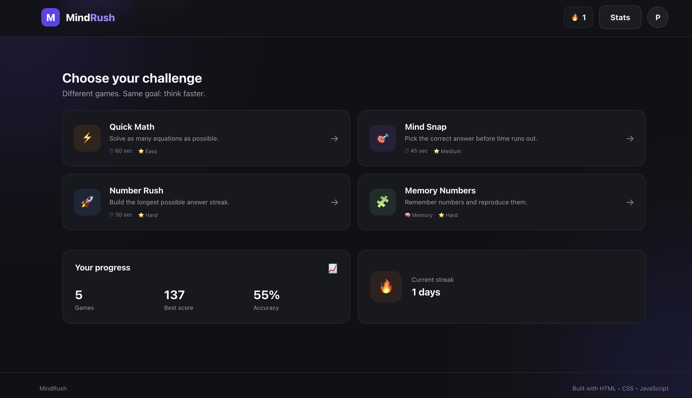

# matrik-game

it is my First website game built to increase/sharp the mind as a young developer.

## Description

This is matrik game website, designed and handcoded by me from scratch, it is a place where user can do there maths practice, memory practice and make there mind sharper

This game is built using Html, and CSS and bunch of javascript I choose html, js after researching and i already know and it's easy

There is currently no backend, because  im focusing on learning javascript and improving my logic development skills.

The project is complited, and I plan to continue this , expanding it with m ore projects, features, animations, and improvements as I learn.

## Screenshots

Add at least one screenshot of the portfolio here.

Example:




## Getting Started

### Dependencies
html, 
css, 
javascript

The project is primarily built and run using **html & javascript here**.

### Installing

Clone the repo here:

```bash
git clone [repo](https://github.com/rajayadav/matrik-game)
```

Move into the project folder:

```bash
cd matrik-game
```

### Executing program

Start the development server:

```click
go live
```

Then open the local URL shown in your terminal, usually->

```text
it will go live after the live server
```

The exact port may be different depending on your project configuration.

## Help

If the project does not start, try reinstalling the dependencies: live server


Make sure you are running the commands from the project directory.

## License

This project is currently a personal portfolio project. No specific open-source license has been added yet.
